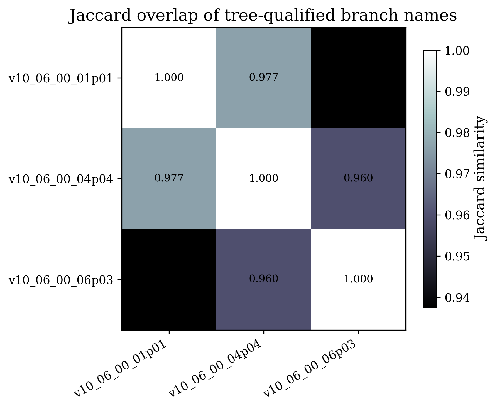
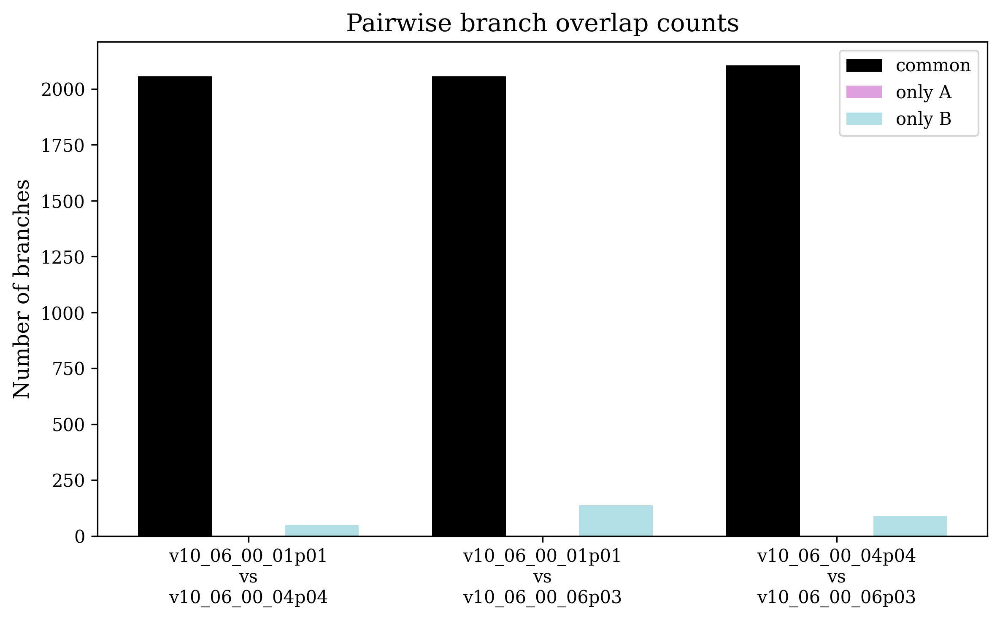

# 🔬 ICARUS CC1e0pi Selection Framework

> A modular CAFAna/SBNAna-based selection framework for the **BNB CC1eNp0π** channel in ICARUS, supporting both Pandora (legacy) and NuGraph2 reconstruction workflows.

---

## 📋 Table of Contents

- [Physics Signal Definition](#-physics-signal-definition)
- [Version History](#-version-history)
- [Repository Structure](#-repository-structure)
- [Environment Setup](#-environment-setup)
- [Include Order](#-include-order)
- [NuGraph vs Pandora Toggle](#-nugraph-vs-pandora-toggle)
- [Running the Code](#-running-the-code)
- [Ntuple Output](#-ntuple-output)
- [Key Tunable Parameters](#-key-tunable-parameters)
- [Notes on CAF Compatibility](#-notes-on-caf-compatibility)
- [Contact](#-contact)

---

## ⚛️ Physics Signal Definition

**CC1eNp0π** — charged-current electron neutrino interaction with:

| Particle | Requirement |
|----------|-------------|
| Primary electron | Exactly 1, KE > 200 MeV (configurable) |
| Protons | ≥ 1 visible, KE > 40 MeV, contained (configurable) |
| Pions | 0 visible (KE < 30 MeV threshold) |
| Vertex | Inside fiducial volume |

> **Note on cuts:** The initial cuts in this first version are those developed by [Riccardo Triozzi](https://github.com/rtriozzi) and collaborators for a Pandora-based NuMI νe CC selection. They serve here as a diagnostic baseline for BNB before subsequent tuning. Future versions will focus on BNB-optimised cuts.

---

## 🏷️ Version History

### `v1.0.0` — Proof of Principle *(this release)*
- Initial framework with modular split headers
- TTree ntuple output for downstream Python analysis
- NuGraph2 toggle via `#define USE_NUGRAPH` in `Config.h`
- Supports both NuGraph2 and vanilla Pandora flat CAF inputs
- First BNB files: official CAFs produced in `v10_06_00_06p03`
- Cuts derived from Pandora-based NuMI νe CC selections as a baseline
- Per-PFP vector branches for full NuGraph vs Pandora comparison
- Efficiency, purity, and selection plots in a single `MakeAll.C` run

> Future versions will introduce BNB-optimised cuts, NuGraph-specific cut tuning, systematics handling, and cross-section machinery.

---

## 📁 Repository Structure

```
cc1e0pi_v3/
│
├── include/
│   ├── Config.h                          # Tunable constants + USE_NUGRAPH toggle
│   ├── CC1e0piSelection_Vars_Base.h      # Geometry, basic vars, particle ID helpers
│   ├── CC1e0piSelection_Vars_Reco.h      # Mode-dependent reco vars (shower/proton)
│   ├── CC1e0piSelection_Vars_Derived.h   # Shower/proton/neutrino vars, SelectionPlots
│   ├── CC1e0piSelection_Vars_NuGraph.h   # NuGraph-only vars (compiled only if USE_NUGRAPH)
│   ├── CC1e0piSelection_Cuts.h           # All cuts, SelDef struct, cutflow steps
│   ├── CC1e0piSelection_TruthCuts.h      # Signal definition, truth cuts, interaction types
│   ├── CC1e0piSelection_Efficiency.h     # SpillMultiVar efficiency machinery
│   └── CC1e0piSelection_Ntuple.h         # TTree branch definitions for Python analysis
│
├── src/
│   ├── CC1e0piSelection_MakeEfficiency.C # Efficiency plots + debug ntuple (fast iteration)
│   └── CC1e0piSelection_MakeAll.C        # Full production: efficiency + purity + selection + ntuple
│
└── output/                               # ← not tracked by git
    ├── root/                             # ROOT output files
    └── plots/                            # Plot outputs
```

---

## 🛠️ Environment Setup

### 1. Start the SL7 container and set up ICARUS

```bash
sh /exp/$(id -ng)/data/users/vito/podman/start_SL7dev_jsl.sh
source /cvmfs/icarus.opensciencegrid.org/products/icarus/setup_icarus.sh
```

### 2. Get a token

```bash
htgettoken -a htvaultprod.fnal.gov -i icarus
```

> ⚠️ **If you see `ImportError: No module named 'site'`**, your token has likely expired. Simply repeat the `htgettoken` command above.

### 3. Set up the analysis environment

Choose based on which icaruscode version you need:

#### Option A — icaruscode `v10_06_00_01p01` *(NuGraph variables)*

```bash
cd /exp/icarus/app/users/sdey2/NuGraphReco/sbnana_NG2
sh /exp/$(id -ng)/data/users/vito/podman/start_SL7dev_jsl.sh
source /cvmfs/icarus.opensciencegrid.org/products/icarus/setup_icarus.sh
source local*/setup
mrbslp
htgettoken -a htvaultprod.fnal.gov -i icarus
```

#### Option B — icaruscode `v10_06_00_04p04` *(2D deconvolution)*

> 🚧 *Coming soon*

---

## 📐 Include Order

The headers have strict dependencies — always include in this order:

```cpp
#include "Config.h"                          // no dependencies
#include "CC1e0piSelection_Vars_Base.h"       // needs Config.h
#include "CC1e0piSelection_Vars_Reco.h"       // needs Vars_Base.h
#include "CC1e0piSelection_Vars_Derived.h"    // needs Vars_Base.h + Vars_Reco.h
#include "CC1e0piSelection_Vars_NuGraph.h"    // needs Vars_Derived.h (only if USE_NUGRAPH)
#include "CC1e0piSelection_Cuts.h"            // needs all Vars headers
#include "CC1e0piSelection_TruthCuts.h"       // needs Cuts.h
#include "CC1e0piSelection_Efficiency.h"      // needs TruthCuts.h
#include "CC1e0piSelection_Ntuple.h"          // needs all of the above
```

---

## 🔀 NuGraph vs Pandora Toggle

In `Config.h`, comment or uncomment this line to switch modes:

```cpp
// #define USE_NUGRAPH   // comment out for Pandora (legacy) mode
```

| Mode | Toggle state | Shower ID | Proton ID |
|------|-------------|-----------|-----------|
| **Pandora (default)** | Commented out | Track score threshold | Chi2 PID |
| **NuGraph2** | Defined | Semantic category (`sem_cat == 2`) | Semantic category (`sem_cat == 1`) |

The `#define` controls `#ifdef USE_NUGRAPH` blocks in `Vars_Reco.h`, `Vars_NuGraph.h`, and `Ntuple.h`. Running in Pandora mode with flat CAFs that don't have NuGraph branches is fully supported — no NuGraph proxy fields are accessed.

---

## 🚀 Running the Code

Update the `listFile` path inside the `.C` file to point to your file list, then:

```bash
cd src/

# Quick test (small stats, check for errors)
cafe -bq CC1e0piSelection_MakeEfficiency.C

# Full production run (efficiency + purity + selection + ntuple)
cafe -bq CC1e0piSelection_MakeAll.C
```

**BNB file list** (official CAFs, `v10_06_00_06p03`):
```
/exp/icarus/data/users/sdey2/fileLists/bnb_nominalflux_caf.list
```
~28,600 files, ~5 hour runtime.

**Output** goes to `output/root/`.

---

## 📊 Ntuple Output

Both macros produce two TTrees under loose pre-selection (`kNotClearCosmic && kVertexInFV && kFlashMatch`):

| Tree | Contents |
|------|----------|
| `ntuple` | ~100 flat scalar branches per slice |
| `ntuple_pfp` | ~30 per-PFP vector branches (variable length per event) |

### Reading in Python

```python
import uproot
import awkward as ak
import numpy as np

f = uproot.open("output/root/CC1e0piSelection_Efficiency.root")

# flat branches → pandas DataFrame
df = f["ntuple/ntuple"].arrays(library="pd")

# per-PFP vector branches → awkward arrays
pfp = f["ntuple_pfp/ntuple_pfp"].arrays(library="ak")

# apply cuts in Python
signal_mask   = df["is_signal"] == 1
selected_mask = (df["pass_flash_match"] == 1) & (df["shower_energy"] > 0.2)

# efficiency
efficiency = (signal_mask & selected_mask).sum() / signal_mask.sum()

# threshold sweep
for threshold in [0.1, 0.15, 0.2, 0.25, 0.3]:
    sig = signal_mask & (df["true_electron_ke"] > threshold)
    eff = (sig & selected_mask).sum() / sig.sum()
    print(f"  KE > {threshold:.2f} GeV → efficiency = {eff:.3f}")
```

### Flat branch groups

| Prefix | Description |
|--------|-------------|
| `true_*` | Truth: neutrino kinematics, Q², W, particle counts, thresholds |
| `reco_vtx_*` | Reconstructed vertex position and FV flag |
| `shower_*` | Leading shower: all 3 planes of energy/dEdx/hits, NuGraph scores |
| `fm_*` | Flash match variables |
| `lead_proton_*` | Leading proton kinematics, chi2, NuGraph scores, truth matching |
| `longest_trk_*` | Muon veto inputs |
| `reco_*` | Reco neutrino energy, inelasticity, transverse momentum, e-p angle |
| `slice_*` | nu score, crumbs score, n PFPs, clear cosmic flag |
| `pass_*` | Fixed upstream cut flags (for Python-side selection) |
| `ng_*` | NuGraph event-level (only if `USE_NUGRAPH`) |
| `pfp_*` | Per-PFP: track score, NuGraph scores, hits, calorimetry, truth matching |

---

## ⚙️ Key Tunable Parameters

All thresholds live in `Config.h` — change them there and recompile:

| Parameter | Default | Description |
|-----------|---------|-------------|
| `THRESHOLD_E` | `0.2 GeV` | Min true electron KE for signal definition |
| `VISIBILTY_THRESHOLD_P` | `0.04 GeV` | Min true proton KE |
| `VISIBILTY_THRESHOLD_PI` | `0.03 GeV` | Min true pion KE |
| `SHOWER_ENERGY_MIN` | `0.2 GeV` | Min reco shower energy cut |
| `SHOWER_DEDX_MAX` | `3.5 MeV/cm` | Max shower dEdx cut |
| `SHOWER_ANGLE_MAX` | `15 deg` | Max shower opening angle cut |
| `SHOWER_CONVGAP_MAX` | `4 cm` | Max shower conversion gap cut |
| `FM_DELTA_Z_MIN/MAX` | `±100 cm` | Flash match ΔZ window |
| `FM_FLASH_T_MIN/MAX` | `0/9.8 µs` | Flash time window |
| `PROTON_CHI2_MAX` | `80` | Max chi2 proton for proton ID |
| `MUON_CHI2_MUON_MAX` | `30` | Max muon chi2 for muon veto |

---

## 📝 Notes on CAF Compatibility

This framework was developed against flat CAFs produced in **`v10_06_00_01p01`** (the NuGraph2-enabled icaruscode version). However, flat CAF branch names and structure are highly stable across icaruscode production versions — a systematic comparison across three versions confirms this.

### Branch overlap across icaruscode versions

A Jaccard similarity analysis of tree-qualified branch names across `v10_06_00_01p01`, `v10_06_00_04p04`, and `v10_06_00_06p03` shows **96–97.7% overlap** between versions:



The pairwise branch count comparison confirms that the vast majority of branches are shared, with only a small number unique to each version:



> Analysis performed in `dev/portVersion/cafVarDiffbetweenVersions.ipynb`.

### Implications

- Variable names and structure in flat CAFs are highly stable across production versions — empirically, changes are at the **<4% level** in variable names between versions checked
- The first full BNB production run uses official CAFs from **`v10_06_00_06p03`**, and the macros compile and run correctly against those files
- **Pandora-only analysis** (i.e. `USE_NUGRAPH` commented out) works with standard flat CAFs from any production version — no NuGraph branches are required

---

## 📬 Contact

**Sparshita Dey** — ICARUS collaboration
GitHub: [@sparshitadey](https://github.com/sparshitadey)
